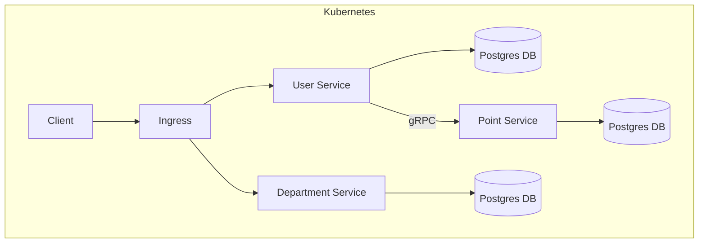

# Kubernetes & Helm Deployment for Go Microservices on AWS EKS

This repository focuses on **deploying a Go-based microservices system to Kubernetes using Helm, with container images stored in Amazon ECR and workloads running on Amazon EKS**.

The primary goal of this project is to **deeply understand the mechanics of Kubernetes, Helm, ECR, and EKS**—from local development to environment-based deployments—before layering on modern CI/CD automation.


### Demo
**Run Locally:**
Run the following command
```bash
kubectl get node -o wide
```
Note the INTERNAL-IP value and add the following line in /etc/hosts file
```bash
INTERNAL-IP    nginx.local
```
For example: 
```bash
192.168.49.2    nginx.local
```
Then run the following commands

```bash
make minikube-build
make deploy
```
Prerequisites: Docker and minikube must be installed on your machine.
<br/>
Then run the following commands

```bash
curl nginx.local/v1/departments
curl nginx.local/v1/users
```

## 📚 Repository Series Context

This repository is part of a three-repository learning and production series:

1. **[backend-microservices](https://github.com/syedomair/backend-microservices)**
   - Go application code
   - REST & gRPC services
   - Dockerfiles and Docker Compose
   - Business logic and testing

2. **backend-k8-helm** (this repository)
   - Kubernetes fundamentals
   - Helm chart design
   - Environment-aware deployments
   - EKS-ready infrastructure

3. **[backend-k8-helm-cicd](https://github.com/syedomair/backend-k8-helm-cicd)**
   - GitHub Actions workflows
   - Secure CI/CD pipelines
   - Automated build, push, and deploy
   - Production-grade GitOps-style flow

This repository intentionally sits *between* application development and full CI/CD automation.

### 🎯 Scope & Purpose
This repository is intentionally infrastructure-focused.
* It does not focus on Go application development
* It assumes the microservices already exist and are containerized

The emphasis is on:
* Helm chart design
* Environment separation (dev / stage / prod)
* Image versioning and registry management
* Secrets and configuration injection
* AWS-native Kubernetes deployment workflows

🔗 Note:
The Go microservices code itself lives in a separate repository, [backend-microservices](https://github.com/syedomair/backend-microservices) where the same APIs can be run locally using Docker Compose.
This repository picks up after that and shows how the same services are deployed to Kubernetes in a production-style setup.

## 🚫 Non-Goals

This repository does NOT cover:
- Go application logic
- REST or gRPC handler implementations
- Business-domain concerns
- CI/CD automation (covered in [backend-k8-helm-cicd](https://github.com/syedomair/backend-k8-helm-cicd))

The focus here is strictly on Kubernetes and Helm mechanics.


### 🧱 Architecture Overview
The system consists of independently deployable Helm charts, one per component:
* user-service
* department-service
* point-service
* postgres (dev-only)
* ingress (NGINX)

Each microservice:
* Is packaged as its own Helm chart
* Can be upgraded or rolled back independently
* Uses environment-specific values files (values-dev.yaml, values-stage.yaml, values-prod.yaml)

Container images are:
* Built locally or via Makefile targets
* Pushed to Amazon ECR
* Pulled by EKS using Helm-provided image configuration




### 🔧 Configuration Strategy
* ***Environment variables*** are loaded from .env.<env> files (.env.dev, .env.stage, .env.prod)
* Sensitive values (e.g., DATABASE_URL) are injected at deploy time via Helm --set
* Image registry and tags are parameterized, allowing:
    * The same Helm chart to be reused across environments
    - Docker images are environment-agnostic
    - The same image is reused across dev, stage, and prod
    - Environment-specific behavior is controlled via:
    - Helm values files
    - Runtime-injected secrets
    - Image registry and tag overrides

This prevents configuration drift and supports safe promotions across environments.

### 🔄 Environment Promotion Model

- `dev` runs locally on Minikube
- `stage` mirrors production infrastructure on EKS
- `prod` uses the same Helm charts with stricter values

Only configuration changes between environments — not application code.

Example deployment command (via Makefile):

```bash
make deploy ENV=stage
```

This expands into environment-aware Helm upgrades using:
* Environment-specific values files
* Runtime overrides for secrets, image registry, and tags

### 🛠 Makefile as a Local Deployment Orchestrator

A single ***Makefile*** acts as a lightweight orchestration layer that:
* Builds Docker images per environment
* Authenticates with Amazon ECR
* Tags and pushes images
* Deploys or upgrades Helm releases
* Supports:
    * dev (Minikube)
    * stage (EKS)
    * prod (EKS)

This mirrors how CI/CD pipelines behave, making the transition to tools like GitHub Actions or Argo CD straightforward.

### 🧠 Who This Repo Is For
* Developers learning real-world Kubernetes & Helm
* Engineers transitioning from Docker Compose to Kubernetes
* Anyone wanting a clear, non-magical EKS deployment flow
* Interview preparation for DevOps / Platform / Backend roles